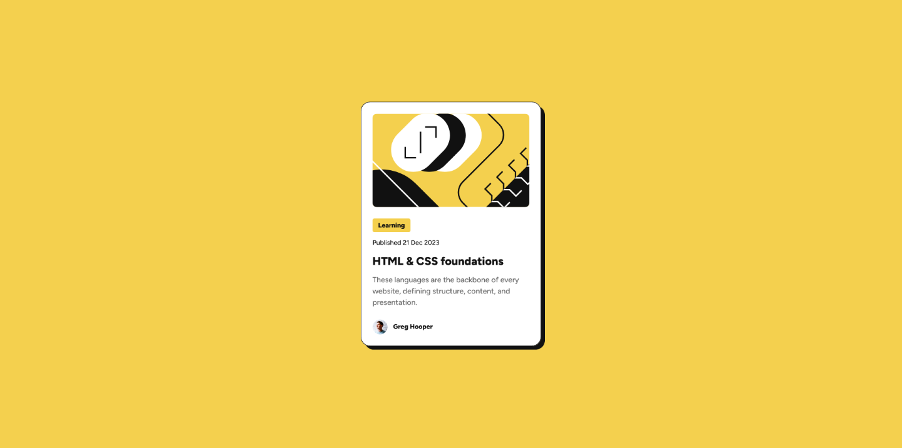

# Frontend Mentor - Blog preview card solution

This is a solution to the [Blog preview card challenge on Frontend Mentor](https://www.frontendmentor.io/challenges/blog-preview-card-ckPaj01IcS)

## Table of contents

- [Overview](#overview)
  - [The challenge](#the-challenge)
  - [Screenshot](#screenshot)
  - [Links](#links)
- [My process](#my-process)
  - [Built with](#built-with)
  - [What I learned](#what-i-learned)
  - [Continued development](#continued-development)
  - [Useful resources](#useful-resources)
- [Author](#author)

## Overview

### The challenge

Users should be able to:

- See hover and focus states for all interactive elements on the page

### Screenshot



### Links

- Solution URL: [https://github.com/muchiribytes/blog-preview-card](https://github.com/muchiribytes/blog-preview-card)
- Live Site URL: [https://muchiribytes.github.io/blog-preview-card/](https://muchiribytes.github.io/blog-preview-card/)

## My process

### Built with

- Semantic HTML5 markup
- CSS custom properties
- Flexbox layout
- Fluid typography using CSS `clamp()`
- BEM (Block Element Modifier) class naming conventions
- Mobile-first responsive structure

### What I learned

During this project, I focused on implementing fluid typography to adjust font sizes across smaller screens without using traditional `@media` query blocks. By leveraging CSS `clamp()` combined with viewport units, font sizes scale seamlessly based on screen width.

```css
/* Fluid Typography with clamp() */
:root {
  --fs-title: clamp(1.25rem, 1.1rem + 0.65vw, 1.5rem);
  --fs-body: clamp(0.875rem, 0.82rem + 0.25vw, 1rem);
  --fs-tag: clamp(0.75rem, 0.7rem + 0.2vw, 0.875rem);
}
```

I also configured interactive hover and focus styles for keyboard navigation accessibility:

```css
.card__link:hover,
.card__link:focus-visible {
  color: var(--clr-primary-yellow);
  outline: none;
}
```

### Continued development

In upcoming challenges, I plan to continue refining:

- Advanced keyboard interaction patterns and custom focus rings.
- Dynamic theme switching using CSS custom properties and JavaScript.
- Micro-animations for card hover states.

### Useful resources

- [MDN Web Docs - clamp()](https://developer.mozilla.org/en-US/docs/Web/CSS/clamp?utm_source=gemini) - Essential reference for building fluid font sizing formulas without media queries.
- [A Modern CSS Reset by Andy Bell](https://piccalil.li/blog/a-more-modern-css-reset/?utm_source=gemini) - Great foundation for structural resets and predictable rendering across browser engines.

## Author

- Frontend Mentor - [@muchiribytes](https://www.google.com/search?q=https://www.frontendmentor.io/profile/muchiribytes&utm_source=gemini)
- Twitter - [@muchiribytes](https://www.google.com/search?q=https://x.com/muchiribytes&utm_source=gemini)
